# Writing Business Logic with TypeScript
An introduction to TypeScript for the Application Developer.

## Introduction
The world of business applications is roughly split in three.

- Technology behind the scenes: Never seen by the user.
- Application Development: User focused business logic.
- The surface of buttons and fields seen by the user.

This article will focus entirely on writing business logic with TypeScript.

### TypeScript

Before using a new language we have to get a bit familiar with the language syntax and basics.

- [TypeScript for Java/C# Prograammers](https://www.typescriptlang.org/docs/handbook/typescript-in-5-minutes-oop.html)
- [TypeScript for Functional Programmers](https://www.typescriptlang.org/docs/handbook/typescript-in-5-minutes-func.html)
- [DOM Manipulation](https://www.typescriptlang.org/docs/handbook/dom-manipulation.html)
- [TypeScript Cheat Sheets](https://www.typescriptlang.org/cheatsheets)

### A nice UI for Business Apps
Focusing on business logic does not mean that we don't care for a
beautiful user interface, but it means that we will simply be using
[Bootstrap](https://getbootstrap.com/). These friendly looking buttons are used all over the internet and that is why it looks familiar. The structure of the app is defined in [HTML](https://www.w3schools.com/html/).

### Helpfull Techology for Web Apps
We still need techology for making our apps run, but we will keep it as simple as possible to know what exactly is going on and to avoid introducing any kind of magic. By magic, I mean installing someoneelses magic packages.

- Programming Language: [TypeScript](https://www.typescriptlang.org/)
- JavaScript runtime: [Node.js](https://nodejs.org/en/)


### Work environment.
- OS: Windows and MacOS.
- Editor: [Visual Studio Code](https://code.visualstudio.com/)

## Installation and Setting up

### Setup a working folder

Create a new folder `learning-ts` for your woking projects. All the example projects will be places in this folder.

### Terminal

We will use the terminal in Visual Studio Code.

### JavaScript Runtime
To run our code we need a JavaScript runtime.

Chances are that Node.js is allready installed on your computer.
Check the version by writing `node -v` or `node --version` in the terminal.

```
$ node --version
v16.13.1

```

If you don't have it, go to https://nodejs.org/en/ and install it.


### The Editor and Integrated Development Environment
To write our we need an editor and to assist us in getting it right we need an Integrated Development Environment (IDE). [Visual Studio Code](https://code.visualstudio.com/) has everything we need.

In the terminal, navigate to your working folder and type `code` followed by a space and a point. Like this:

```
code .
```

And you should see this.

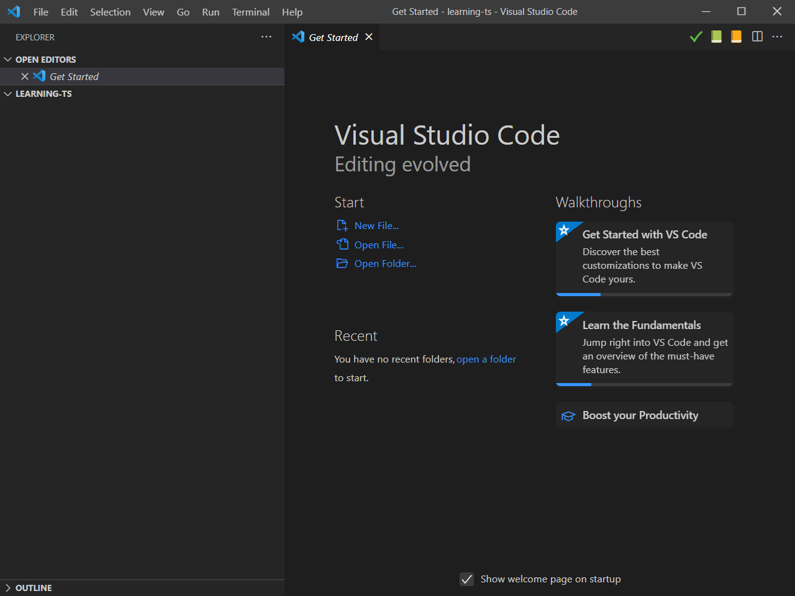

### TypeScript

- [Installing TypeScript](https://www.typescriptlang.org/docs/handbook/typescript-tooling-in-5-minutes.html)

### Bootstrap
We will get back to this later.

## Boilerplate

Let's get our first TypeScipt example up and running.

Before we can start on writing the actual program and focus on business logic, we need an environment consisting of a few files and a few folders with very specific names. We call this a boilerplate and we will use it for each new example.

We will create files and folders one by one in this section.


### Example 01

From Visual Studio Code choose to create an `example01` folder in the leaning-ts folder.

- Create a `src` folder inside the example01 folder.
- Create a `main.ts` file inside the src folder.

This is where we are going to program our TypeScript application.

Now we need to initialize our TypeScript project. We do this with the command.

```
tsc --init
```

This will create a new file `tsconfig.json` in the root of our project folder. It is a bit overwhelming, but we will take it step by step.

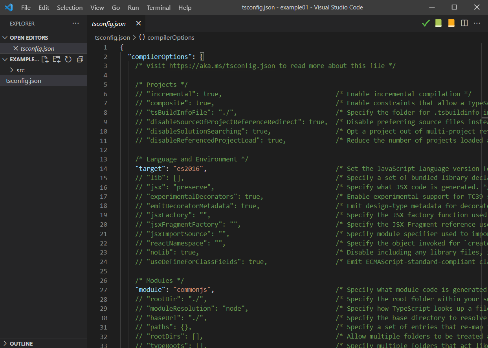

Now we need to tell the TypeScript compiler to find our source program in the `src` folder.

We do this by adding `"include": ["src/**/*"]` at the end of the file. Notice the comma behind the curly bracket just before.

```
  },
  "include": ["src/**/*"]
}
```

Then we need to tell the TypeScript compiler where to put the result

In the file, find the line that says `outDir` and change the line to:

```
"outDir": "dist",
```

Don't forget to remove the `//` signs in front.

Now let us test that it works.

### A little bit of TypeScript code

Copy this into your `main.ts` file and save it.

```
function greeter(person: string) {
    return "Hello, " + person;
}
var user = "James Webb";
document.body.textContent = greeter(user);
```

From the terminal run the TypeScript compiler:

```
tsc
```

You should now have a new folder `dist` with a new file in it `main.js`.

It should look like this.

```TypeScript
"use strict";
function greeter(person) {
    return "Hello, " + person;
}
var user = "James Webb";
document.body.textContent = greeter(user);
```

The generated code is the same, except that the person parameter in the greeter function lost its type declaration `: string`. That is the difference between TypeScript and JavaScript.


Now we are ready to add the `index.html` file to the project, so that we can run in the browser.

Create the `index.html` in the root of the project folder.

In the first line as the first character type an esclamation mark ! followed by a press on the TAB or Enter key.


```
!
```

becomes

```html
<!DOCTYPE html>
<html lang="en">
<head>
    <meta charset="UTF-8">
    <meta http-equiv="X-UA-Compatible" content="IE=edge">
    <meta name="viewport" content="width=device-width, initial-scale=1.0">
    <title>Document</title>
</head>
<body>

</body>
</html>
```

Change `<title>Document</title>` to `<title>Example 01</title>`


To run our program from the browser we have to point to our generated JavaScript file.

Between `<body>` and `</body>` insert this line

```
<body>
    <script src="dist/main.js"></script>
</body>
```

Select the index.html file on the right, select the Run menu, then  select Run Without Debugging or press Ctrl+F5.

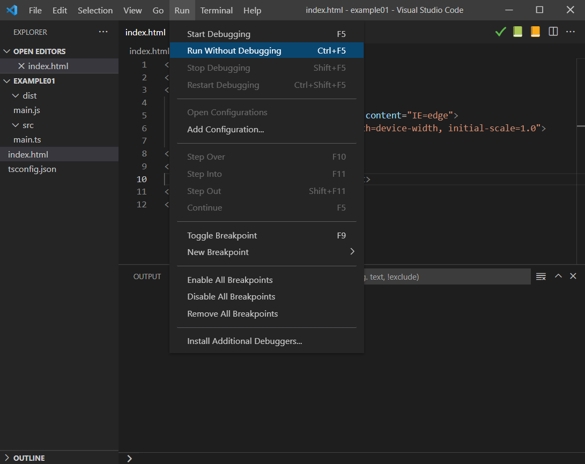

Congratulations!

Your boilerplate is ready and you now know how to setup a TypeScript program that runs in the browser. We will use this in each of the following examples that we are going to program.

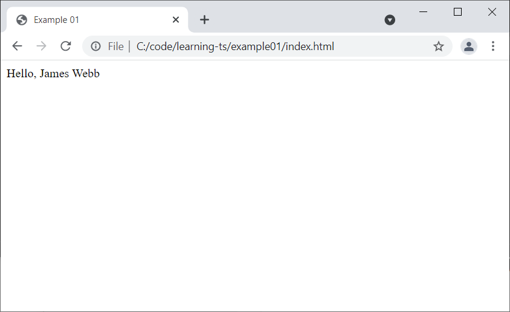


## DOM Manipulation

We need to take control of the Document Object Model [DOM](https://developer.mozilla.org/en-US/docs/Web/API/Document_Object_Model/Introduction) so we can implement our application.

So we are going to extend our boilerplate.

### Example 02

Make a copy of the folder `example01` and call it `example02`. Then open it in Visual Studio Code.
Don't forget to change the title to **Example 02**.

We are going to use the example from [DOM Manipulation](https://www.typescriptlang.org/docs/handbook/dom-manipulation.html).

Open the `index.html` file and insert the following line right after the `<body>` tag and before the `<script>` tag.

```
<body>
    <div id="app"></div>
    <script src="dist/main.js"></script>
</body>
```

The `id="app"` gives us a handle in the DOM. An elelement we know exists and that we can hold on to from our TypeScript app.

Save the index.html file and open the `main.ts` file.

We are going to replace this

```
document.body.textContent = greeter(user);
```

with this

```
// 1. Select the div element using the id property
const app = document.getElementById("app");

// 2. Create a new <p></p> element programmatically
const p = document.createElement("p");

// 3. Add the text content
p.textContent = greeter(user);

// 4. Append the p element to the div element
app?.appendChild(p);
```

In Visual Studio Code choose the Terminal menu and choose New Terminal.

Then compile the TypeScript without comments with this command.

```
tsc --removeComments
```

And look at the generated `main.js` file.

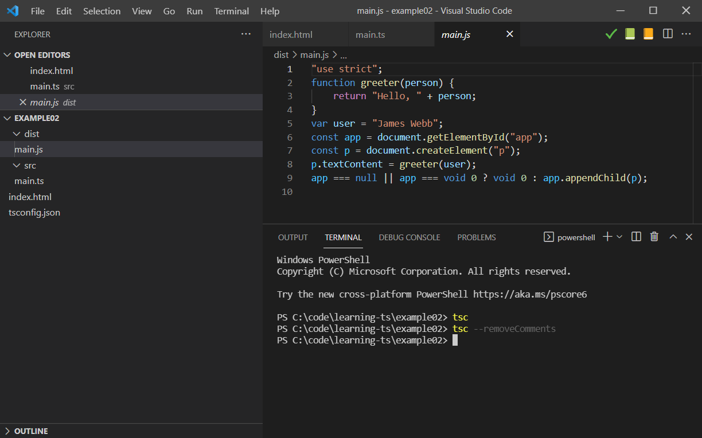

Now select the index.html filed and run the file with Ctrl+F5.

Open it with Chrome, right click on the page and choose Inspect.

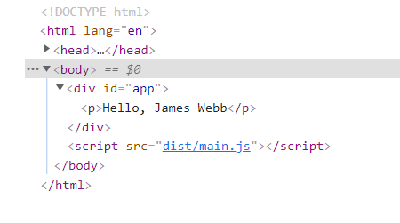

Now we can see the generated HTML and see that the `<p>` tag was insert inside the `<div>` tag.

## String Manipulation in TypeScript

Before developing more fancy web applications, we want to understand how to use variables of different types and manipulation of these in TypeScript.

Therefore we will develop a function and test some examples and writing the results to the web page.

### Example 03

Have the function **non_repeating_character(str)** take the str parameter being passed,
which will contain only alphabetic characters and spaces, and
return the first non-repeating character.

**Examples**

The string will always contain at least one character and there will always be at least one non-repeating character.

```
Input: "agettkgaeee"
Output: k
```


```
Input: "abcdef"
Output: a
```

```
Input: "hello world hi hey"
Output: w
```

### Example 03

Make a copy of the folder `example02` and call it `example03`. Then open it in Visual Studio Code.
Don't forget to change the title to **Example 03**.

Solution:

```
// Functions

function non_repeating_character(str: string): string {
    var array: string[];
    array = str.split('');
    for (var i = 0; i < array.length; i++) {
        if (occurences(array[i], array) == 1) {
            return array[i]
        }
    }
    return ""
}

function occurences(element: string, array: string[] ): number {
    var counter: number = 0
    for (var i = 0; i < array.length; i++) {
        if (array[i] == element) {
            counter++
        }
    }
    return counter
}
```

```
// Test input and expected results

const input1: string = "agettkgaeee";
const input2: string = "abcdef";
const input3: string = "hello world hi hey";

const expected_output1: string = "k"
const expected_output2: string = "a"
const expected_output3: string = "w"

// Function to present the result og the test

function present_answer(str: string, result: string, expected: string) {
    if (result == expected) {
        return `Success: First non repeating character in ${str} is ${result}. `
    } else {
        return `Failure: Expected first non repeating character in ${str} to be ${expected}, but I found ${result}. `
    }
}
```

```
// Manipulating the DOM

// 1. Select the div element using the id property
const app = document.getElementById("app");

// 2. Create a new <p></p> element programmatically
const p1 = document.createElement("p");
const p2 = document.createElement("p");
const p3 = document.createElement("p");

// 3. Add the text content
p1.textContent = present_answer(input1, non_repeating_character(input1), expected_output1);
p2.textContent = present_answer(input2, non_repeating_character(input2), expected_output2);
p3.textContent = present_answer(input3, non_repeating_character(input3), expected_output3);

// 4. Append the p element to the div element
app?.appendChild(p1);
app?.appendChild(p2);
app?.appendChild(p3);
```

Functions in color.

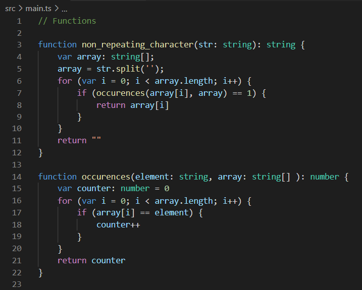

Result in black and white.

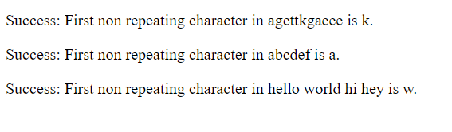


## State of the Application

We want action! Buttons to press. Things to happen.

In this example we will create a simple app with a button to press and toggle between two states.

Make a copy of the folder `example02` and call it `example04`. Then open it in Visual Studio Code.
Don't forget to change the title to **Example 04**.

### Application State
The purpose of this exercise is to demonstrate control over the state of the application.

The State is often refered to as the Model in Design Patterns like Model View Controler (MVC) or Model View Update (MVU).

What is State? Some examples.
- The light is on or off.
- A coin is either head or tail.
- A dices on the table shows one of these values 1, 2, 3, 4, 5, or 6.

There is one rule to observe and this is very important. Your application must never get into an illegal state.
We are going to observe that illegal states are impossible.

The reason is that quite simple: Bugs, unexpected behavious and errors are all due to your application getting into some kind of unforseen state.
So having control over your state is a fundamental condition for having a **robust application**.

That does not mean that everything is always going as expected, but we are planning for it.
A failed state might be OK, as opposed to an illegal state.


### Example 04

This example will extend our boilerplate to handle the state of the application.
We will continue with this pattern in the following examples.

Our application in example 4 will consist of a button that we can click and a simple text displaying our favorite programming language.
There will only be two options `JavaScript` and `Python`.

#### Defining the State, the legal states and the initial state.

We will start by defining the strucure of the State, the possible legal states and the initial state.

- `success: boolean` tells us if we are in a state of success or in a state of failure.
- `favorite_language` if we are in the success state, this field contains our current favorite language.
- `error_message` if we are in the failed state, this field contains an error message that we can present to the user.

```
type State = {
    success: boolean,
    favorite_language: string,
    error_message: string
};
```

The we are going to specify three legal states the app can be in. Two success states and one failure.

```
const legalState1: State = { success: true, favorite_language: "JavaScript", error_message: "" };
const legalState2: State = { success: true, favorite_language: "Python", error_message: "" };
const failedState: State = { success: false, favorite_language: "", error_message: "Did not get state from session storage." };
```

Finaly we decide that our initial state will be the first legal state.

```
const initialState: State = legalState1;

```

We will keep this pattern in the following examples.

#### Keeping the State

To keep track of our state we are going to use the `sessionStorage` functionality.

We need to be able to initialize the state, get the state and set the state to a new value.
These functions help us with just that. Plus a function to report what state we are in to the console.log if we need to debug what is going on.

```
// This is the key to the storage. It must be unique. Do not change.
const storageKey: string = "app_state";

// The functions we will use in all our applications. Do not change.
function setAppState(newState: State): void {
    let newStateJSON: string = JSON.stringify(newState);
    sessionStorage.setItem(storageKey,  newStateJSON);
};

function getAppState(): State {
    let failedStateJSON: string = JSON.stringify(failedState);
    let storedState: State = JSON.parse(sessionStorage.getItem(storageKey) || failedStateJSON);
    if (!storedState.success) {
        reportState('getAppState', storedState);
    }
    return storedState
}

function initAppState(): void {
    clearAppState();
    setAppState(initialState);
}

function clearAppState(): void {
    sessionStorage.removeItem(storageKey);
}

function reportState(where: string, state: State): void {
    if (!state.success) {
        console.log(`${where}: Error state detected. Error message: ${state.error_message}`);
    } else {
        console.log(`${where}: Everyting is fine. Favorite Language: ${state.favorite_language}`);
    }
}
```

Then we need to be able to update our state when we click the button and we need a helper function to compare states with each other.

Of cause it would have been nice to write

```
function sameState(state1: State, state2: State): boolean {
   return (state1 == state2);
}

```

But that is not how the world works. We have to be explicit about what it means to compare two states. And compare of objects in JavaScript is a chapter in itself.

```
function sameState(state1: State, state2: State): boolean {
    if (state1.success == state2.success) {
        if (state1.success) {
            return (state1.favorite_language == state2.favorite_language);
        } else {
            return (state1.error_message == state2.error_message)
        }
    } else {
        return false
    }
}

function updateState(): void {
    let currentState: State = getAppState();

    if (currentState.success) {
        if (sameState(currentState, legalState1)) {
            setAppState(legalState2);
        };

        if (sameState(currentState, legalState2)) {
            setAppState(legalState1);
        };
    } else {
        reportState('updateState', currentState);
        setAppState(initialState);
    }

    updateView();
}
```

Notice that if our current state is in an error state, then we report it and then we fix it by putting it back to the initial state.
That is just a choice.

Now we can initialize and update our state.

Finaly we are going to display the state to the user. The View in the MVC and MVU patterns.

```
// BUILDING OUR WEB PAGE
// Initialize the application
initAppState();

// 1. Select the div element using the id property
const app = document.getElementById("app");

// 2. Create new elements programmatically
const main_div = document.createElement("div");
const title_h1 = document.createElement("h1");
const body_div = document.createElement("div");
const button = document.createElement("button");
const body_text = document.createElement("h2");
body_text.setAttribute("id", "display_state")

// 3. Add the text content
title_h1.textContent = "Your TypeScript App is working!";
button.textContent = "Toggle";
button.addEventListener("click", updateState);

initView();

// 4. Append the elements together
body_div.appendChild(button);
body_div.appendChild(body_text);
title_h1.appendChild(body_div);
main_div.appendChild(title_h1);
app?.appendChild(main_div);

```

The important part here is that we have a static part, an event part and a dynamic part.

- On our `button` we add an event listener: `button.addEventListener("click", updateState);`
- On our `body_text` we add an identifyer so that we can find it again: `body_text.setAttribute("id", "display_state")`

Finally we need the two missing pieces. To initialize the view and to update the view.


```
function initView(): void {
    let currentState: State = getAppState();
    if (body_text) {
        body_text.textContent = currentState.favorite_language;
    } else {
        reportState('initView', currentState);
    };
}

function updateView(): void {
    let currentState: State = getAppState();
    let new_body_text = document.getElementById("display_state")
    if (new_body_text) {
        new_body_text.textContent = currentState.favorite_language;
    } else {
        reportState('updateView', currentState);
    };
}
```

Now run the application.

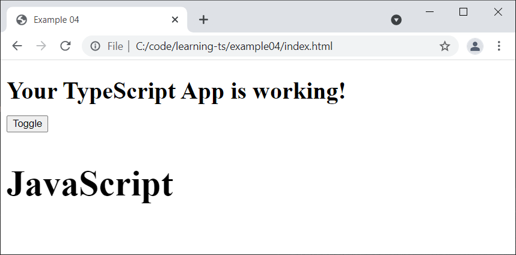

Click.

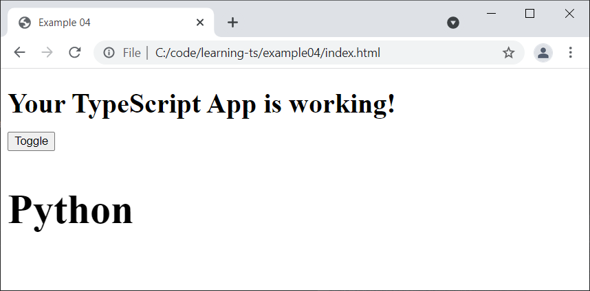


## Bootstrap

Now while that is very nice, feature wise, it could look a bit better and now is the time to introduce [bootstrap](https://getbootstrap.com/).

Copy this line into the `<head>` tag before your title.

```
<link href="https://cdn.jsdelivr.net/npm/bootstrap@5.1.3/dist/css/bootstrap.min.css" rel="stylesheet" integrity="sha384-1BmE4kWBq78iYhFldvKuhfTAU6auU8tT94WrHftjDbrCEXSU1oBoqyl2QvZ6jIW3" crossorigin="anonymous">
```

You can find it [here](https://getbootstrap.com/docs/5.1/getting-started/introduction/#css)


```
<head>
    <meta charset="UTF-8">
    <meta http-equiv="X-UA-Compatible" content="IE=edge">
    <meta name="viewport" content="width=device-width, initial-scale=1.0">
    <link href="https://cdn.jsdelivr.net/npm/bootstrap@5.1.3/dist/css/bootstrap.min.css" rel="stylesheet" integrity="sha384-1BmE4kWBq78iYhFldvKuhfTAU6auU8tT94WrHftjDbrCEXSU1oBoqyl2QvZ6jIW3" crossorigin="anonymous">
    <title>Example 04</title>
</head>

```
Now open your main.ts file and update the view part with this.


```

// 1. Select the div element using the id property
const app = document.getElementById("app");

// 2. Create new elements programmatically
const top_div = document.createElement("div");
const main_div = document.createElement("div");
const title_h1 = document.createElement("h1");
const body_div = document.createElement("div");
const button = document.createElement("button");
const body_text = document.createElement("h2");
body_text.setAttribute("id", "display_state")

// 3. Add the text content
title_h1.textContent = "Your TypeScript App is working!";
button.textContent = "Toggle";
button.addEventListener("click", updateState);
button.setAttribute("type", "button");
button.setAttribute("class", "btn btn-primary");
button.setAttribute("style", "margin:15px;");
main_div.setAttribute("class", "card");
body_div.setAttribute("class", "card-body");
title_h1.setAttribute("class", "card-title");
body_text.setAttribute("class", "card-text");
top_div.setAttribute("class", "container");

initView();

// 4. Append the elements together
body_div.appendChild(title_h1);
body_div.appendChild(body_text);
body_div.appendChild(button);
main_div.appendChild(body_div);
top_div.appendChild(main_div);
app?.appendChild(top_div);

```

Run the app.

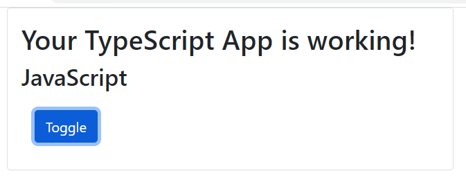

Inspec the page to better understand the HTML structure we have build.

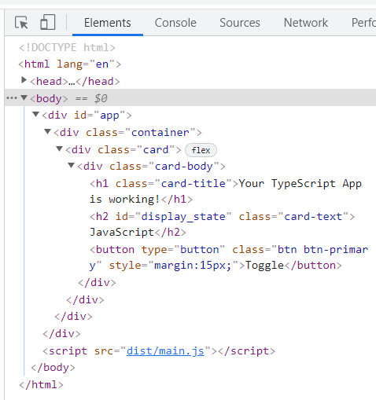


## API and HTTP Requests

Now we going to look at extending our boilerplate to get information from an API.
In a future example we will look at the complete Create, Read, Update and Delete (CRUD) functionality.

Make a copy of the current folder `example04` and call it `example05`. Then open it in Visual Studio Code.
Don't forget to change the title to **Example 05**.

### Example 05

The API is a task manager running on a Heroku server.

The API: https://taskmanager01-api.herokuapp.com/tasks/

Copy/paste the link to the browser. In return you get a list of tasks.

```
[
    {
        "id": 196,
        "title": "Nick L. Andime",
        "description": "We need to synthesize the cross-platform EXE application!",
        "urgency": 3,
        "duration_minutes": 120,
        "attention_date": "2020-06-08",
        "deadline": "2020-06-14",
        "planned_date": "2020-06-08",
        "planned_starting_time": "2000-01-01T19:15:00.000Z",
        "status": 3,
        "created_at": "2020-06-08T14:18:12.815Z",
        "updated_at": "2020-06-08T14:18:12.815Z"
    },
    {
        "id": 197,
        "title": "Cara Van",
        "description": "Use the primary SSL protocol, then you can bypass the wireless microchip!",
        "urgency": 2,
        "duration_minutes": 15,
        "attention_date": "2020-06-08",
        "deadline": "2020-06-14",
        "planned_date": "2020-06-09",
        "planned_starting_time": "2000-01-01T21:45:00.000Z",
        "status": 1,
        "created_at": "2020-06-08T14:18:12.825Z",
        "updated_at": "2020-06-08T14:18:12.825Z"
    }, ...

```

Now take the id from the first record and add it to the link https://taskmanager01-api.herokuapp.com/tasks/196
Now you get just the one task.

```
{
    "id": 196,
    "title": "Nick L. Andime",
    "description": "We need to synthesize the cross-platform EXE application!",
    "urgency": 3,
    "duration_minutes": 120,
    "attention_date": "2020-06-08",
    "deadline": "2020-06-14",
    "planned_date": "2020-06-08",
    "planned_starting_time": "2000-01-01T19:15:00.000Z",
    "status": 3,
    "created_at": "2020-06-08T14:18:12.815Z",
    "updated_at": "2020-06-08T14:18:12.815Z"
}
```

In this example, our task is to read this one record and present it to the user.

Source of data: The world famous **Faker**.


### Extending the state

We are going to introduce a new type Task and extent the state with it.

These are the steps
- Introduce the new entity Task
- Update the State accordingly
- Define possible states and the initial state
- Develop the functionality that will get the first task for us
- Develop our new update function
- Develop our new view function
- remove the favorite_language from the state.

This is the plan.

#### The Task Entity

Start by defining the type TaskEntity and create an initialTask. The initialTask is like the number zero or the empty string.

```
// Task entity
type TaskEntity = {
    id: number,
    title: string,
    description: string,
    urgency: number,
    duration_minutes: number,
    attention_date: string,
    deadline: string,
    planned_date: string,
    planned_starting_time: string,
    status: number,
    created_at: string,
    updated_at: string
}

const initialTask: TaskEntity = {
    id: 0,
    title: "",
    description: "",
    urgency: 0,
    duration_minutes: 0,
    attention_date: "",
    deadline: "",
    planned_date: "",
    planned_starting_time: "",
    status: 0,
    created_at: "",
    updated_at: ""
}
```

Extend the State with with a `current_task` of type `TaskEntity` and a new `app_state`.
The app_state completes the success value with more information.
It basically defines the four legal states our app can be in.

```
type AppStates = "start" | "fetchingTask" | "gotTask" | "error" ;
```

Now our state looks like this:

```
type State = {
    success: boolean,
    app_state: AppStates,
    current_task: TaskEntity,
    error_message: string
};

```

We define two known states. The initial state and the failed state, if something goes wrong with getting the state from the session storage.

```
// Define the failed states the app can be in.
const failedState: State = {
    success: false,
    app_state: "error",
    current_task: initialTask,
    error_message: "Did not get state from session storage."
};

// Define the initial state that the app is starting in. Change it.
const initialState: State = {
    success: true,
    app_state: "start",
    current_task: initialTask,
    error_message: ""
};
```

### Set App State

The setAppState function is our watching over our state and ensures that we do not get into an illigal state.

An illigal state would, for example, be to have success == true while having an error message.

It is only in the `gotTask` state that we have a `current_task` and it is only in the `error` state that we have an `error_message`.

```
function setAppState(newState: State): void {
    switch (newState.app_state) {
        case "start":
        case "fetchingTask": {
            newState.success = true;
            newState.error_message = "";
            newState.current_task = initialTask;
            break;
        }

        case "gotTask": {
            newState.success = true;
            newState.error_message = "";
            break;
        }

        case "error": {
            newState.success = false;
            newState.current_task = initialTask;
            break;
        }
    }

    let newStateJSON: string = JSON.stringify(newState);
    sessionStorage.setItem(storageKey,  newStateJSON);
};

```
### HTTP GET Request

Now we need to write a new function to get our record from the API and return a TaskEntity that we can put into the currentTask in the state.

First I define the url and a task id.

```
const TASKS_API: string = "https://taskmanager01-api.herokuapp.com/tasks";
let TASK_ID: number = 195; // Starting somewhere in the list
```

Then the loadTask function that will attempt to get the task from the API.

If the fetch function returns a json response we update our state with the task and changes the `app_state` to `gotTask`.
Should the fetch fail, for example if you have no intenet access, then we update our state with an error message and changes the `app_state` to `error`.

```
function loadTask(id: number): void {
    let url: string = `${TASKS_API}/${TASK_ID}`;
    let newState: State = getAppState();
    newState.app_state = "fetchingTask";
    setAppState(newState);
    updateView(newState);

    fetch(url, {
        method: 'GET', // default
    })
        .then(function(response: Response): Promise<object> {
            return response.json()
        })
        .then(function(data: object): void {
            let taskEntity: TaskEntity = formatTaskEntity(data);
            newState.app_state = "gotTask";
            newState.current_task = taskEntity;
            setAppState(newState);
            updateView(newState);
        })
        .catch(function(error): void {
            newState.app_state = "error";
            newState.error_message = error;
            setAppState(newState);
            updateView(newState);
        })
}
```

And finally the `getTask` that is going to be called when we click the button.

```
function getTask(): void {
    loadTask(TASK_ID);
    TASK_ID++ // Look for next task
}
```

The `updateView` function is also completely new. Now we set the **title** and **body** depending on the `app_state`.


```
function updateView(currentState: State): void {
    let new_title_text: HTMLElement | null = document.getElementById("display_title")
    let new_body_text: HTMLElement | null = document.getElementById("display_description")
    let button: HTMLButtonElement | null = document.getElementById("display-button") as HTMLButtonElement;

    if (new_title_text && new_body_text && button) {
        switch (currentState.app_state) {
            case "start": {
                new_title_text.textContent = "Welcome again";
                new_body_text.textContent = "Press the button to get a task.";
                button.disabled = false;
                break;
            }

            case "fetchingTask": {
                new_title_text.textContent = "Fetching Task";
                new_body_text.textContent = "Please be patient.";
                button.disabled = true;
                break;
            }

            case "gotTask": {
                new_title_text.textContent = currentState.current_task.title;
                new_body_text.textContent = currentState.current_task.description;
                button.disabled = false;
                break;
            }

            case "error": {
                new_title_text.textContent = "Ups ...";
                new_body_text.textContent = currentState.error_message;
                button.disabled = false;
                break;
            }
        }
    } else {
        reportState('updateView', currentState);
    }
}
```

Finally I have build a set of helper functions to build my html elements.

```
function mkButton(text: string, action: () => void): HTMLElement {
    let element: HTMLElement = document.createElement("button");
    element.textContent = text;
    element.addEventListener("click", action);
    element.setAttribute("id", "display-button");
    element.setAttribute("type", "button");
    element.setAttribute("class", "btn btn-primary");
    element.setAttribute("style", "margin:15px;");
    return element;
}

function mkContainer(card: HTMLElement): HTMLElement {
    let element: HTMLElement = document.createElement("div");
    element.setAttribute("class", "container");
    element.appendChild(card);
    return element;
}

function mkCard(cardBody: HTMLElement): HTMLElement {
    let element: HTMLElement = document.createElement("div");
    element.setAttribute("class", "card");
    element.appendChild(cardBody);
    return element;
}

function mkCardBody(
    title: HTMLElement,
    body: HTMLElement,
    button: HTMLElement
): HTMLElement {
    let element: HTMLElement = document.createElement("div");
    element.setAttribute("class", "card-body");
    element.appendChild(title);
    element.appendChild(body);
    element.appendChild(button);
    return element;
}

function mkCardTitle(text: string): HTMLElement {
    let element: HTMLElement = document.createElement("h1");
    element.setAttribute("id", "display_title");
    element.setAttribute("class", "card-title");
    element.textContent = text;
    return element;
}

function mkCardDescription(text: string): HTMLElement {
    let element: HTMLElement = document.createElement("h2");
    element.setAttribute("id", "display_description")
    element.setAttribute("class", "card-text");
    element.textContent = text;
    return element;
}
```

And now the definition of the HTML elements looks a bit simpler.

```
// Initialize the application
initAppState();

// 1. Select the div element using the id property
const app = document.getElementById("app");

// 2. Create new elements programmatically
const title: HTMLElement = mkCardTitle("Welcome!");
const description: HTMLElement = mkCardDescription("Press the button to get a task.");
const button: HTMLElement = mkButton("Get Task", getTask);

const cardBody: HTMLElement = mkCardBody(title, description, button);
const card: HTMLElement = mkCard(cardBody);
const container: HTMLElement = mkContainer(card);

// 3. Append the elements together
app?.appendChild(container);
```

Run the app again.

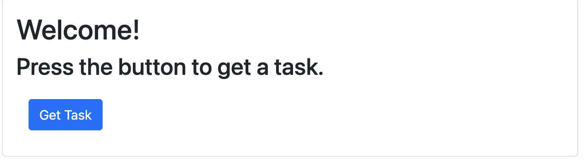

When pressing the button the first time, the app is in the fetching state long enough for you to see it.
This is because the heroku server shuts down automatically when not used. We use it here to verify that our visulalization of the fetching state looks as expected. Once the server has started up, this state is quite short and most of the time you will not see it. 

The `Get Task` button has been disabled in the fetching state, so the user cannot presse it a second time while waiting.

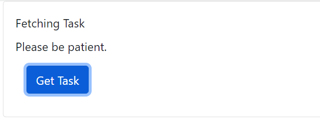

Once task 196 is found, you should see this. 

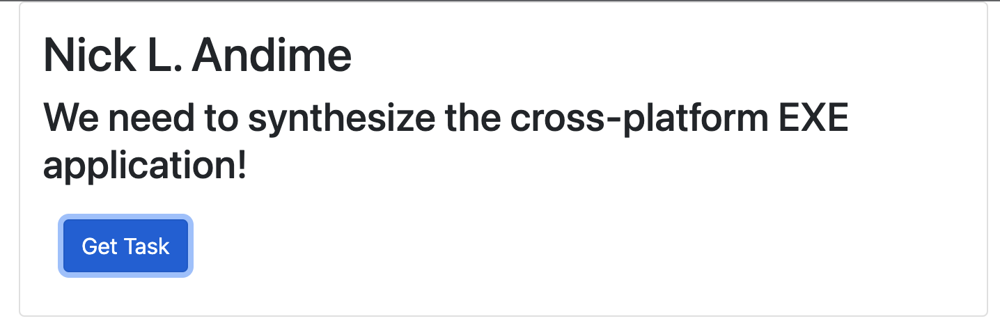

When pressing the button, you should get the next task.

## CRUD

For the final and 6th example we are going to look at the complete Create, Read, Update and Delete (CRUD) functionality.
To be written.
